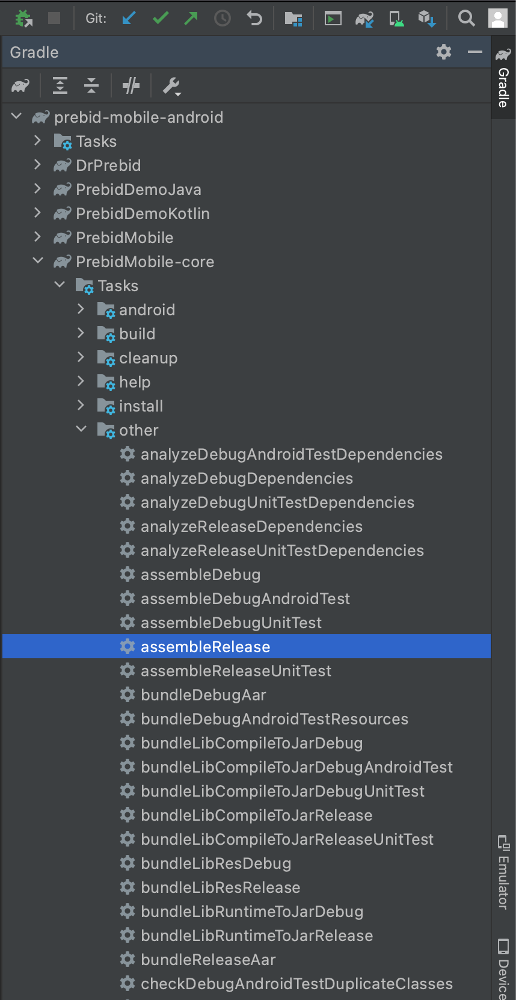

[](https://travis-ci.org/prebid/prebid-mobile-android)

# Prebid Mobile Android SDK

Get started with Prebid Mobile by creating a Prebid Server account [here](http://prebid.org/prebid-mobile/prebid-mobile-pbs.html)

## Use Maven?

Easily include the Prebid Mobile SDK using Maven. Simply add this line to your gradle dependencies:

```
implementation 'org.prebid:prebid-mobile-sdk:[1,2)'
```
If you want explicit stable version, please use the following:
```
implementation 'org.prebid:prebid-mobile-sdk:1.12.1'
```


## Build from source

Build Prebid Mobile from source code. After cloning the repo, from the root directory run

```
./buildprebid.sh
```

to output the final lib jar and package you a demo app.


## Test Prebid Mobile

Run the test script to run unit tests and integration tests.

```
./testprebid.sh
```

## Prebid Mobile from the "playwire" branch

1. After cloning the repo, you have 2 options to to generate the Prebid Mobile library:
    - From the root directory run
    
    ```sh
        ./gradlew -i --no-daemon :PrebidMobile-core:assembleRelease
    ```

    - Open root directory in the Android Studio, expand `Gradle` menu and run `PrebidMobile-core > Tasks > other > assembleRelease`.
    

2. Go to the `./PrebidMobile/PrebidMobile-core/build/outputs/aar` folder and rename `PrebidMobile-core-release.aar` to `prebid-mobile-sdk.arr`.

3. Copy and paste`prebid-mobile-sdk.arr` to your `PlaywireSDK_Prebid/libs` folder.
